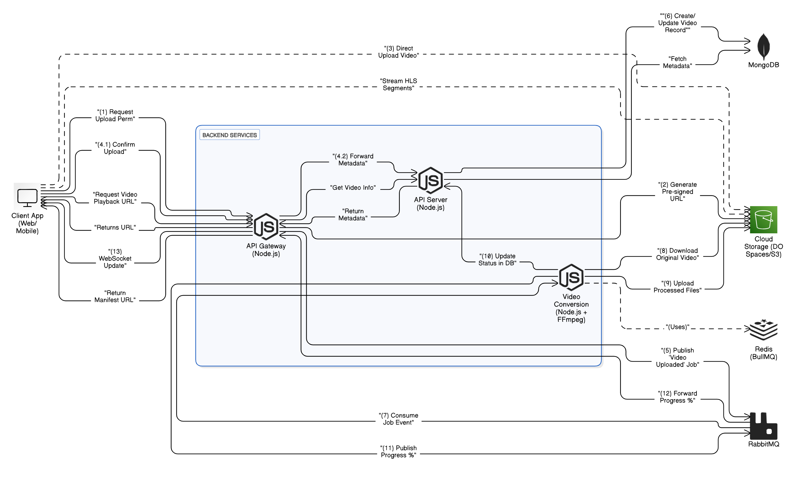

# 🎬 React Video Streaming Client 📺 (Work in Progress!)

[](https://reactjs.org/) [](https://vitejs.dev/) [](https://mui.com/) [](https://redux-toolkit.js.org/) [](https://socket.io/)

This repository contains the frontend client for the Video Streaming Platform, built with **React**, **Vite**, and **Material UI (MUI)**. It provides the user interface for interacting with the backend services, allowing users to upload, browse, and watch videos seamlessly.

**➡️ Check out the Backend Code:** [video-streaming-server](https://github.com/AwalHossain/video-streaming-server)

## 🖼️ System Architecture & Flow

Visualizing how the frontend fits into the larger system:

**Overall Architecture:**


**Upload & Streaming Sequence:**


*(Ensure `architecture.png` and `stream-diagram.png` are present in the root directory)*

## ✨ Frontend Key Features

This client application leverages modern frontend technologies to deliver a rich user experience:

*   **⚡ Blazing Fast Development & Builds:** Uses **Vite** for near-instant Hot Module Replacement (HMR) and optimized production builds.
*   **🎨 Modern & Responsive UI:** Crafted with **React** and **Material UI (MUI)**, providing a sleek, intuitive, and adaptable interface across devices. Includes custom theming (`src/theme`).
*   **▶️ Smooth Video Playback:** Integrates robust video players like **Vidstack**, **React Player**, and potentially **HLS.js/Plyr** to handle efficient streaming (including HLS adaptive bitrate streaming served by the backend).
*   **🔄 Real-time Updates:** Uses **Socket.IO Client** (`src/redux/features/socket/socketApi.js`) to connect with the API Gateway's WebSocket, enabling features like:
    *   Live video processing progress updates.
    *   Real-time notifications (e.g., upload complete).
*   **💾 Efficient State Management:** Leverages **Redux Toolkit** (`src/redux`) for predictable and centralized application state. Includes:
    *   **RTK Query (`apiSlice.js`):** Simplifies data fetching, caching, and synchronization with the backend API, reducing boilerplate.
*   **🧭 Seamless Navigation:** Implements client-side routing using **React Router DOM v6** (`src/routes.jsx`), allowing users to navigate between pages without full page reloads.
*   **☁️ Direct Cloud Upload:** Communicates with the API Gateway to obtain pre-signed URLs, enabling direct-to-cloud storage uploads for better performance and scalability (as shown in the sequence diagram).
*   **🎣 Custom Hooks (`src/hooks`):** Encapsulates reusable logic (e.g., interacting with APIs, managing component state) for cleaner code.
*   **📄 Form Handling:** Likely utilizes libraries like **Formik** or **React Hook Form** (both listed in `package.json`) along with **Yup** for robust form creation and validation (e.g., search, login/signup, video metadata input).
*   **📈 API Communication:** Uses **Axios** for making HTTP requests to the backend API Gateway.
*   **Infinite Scrolling:** Implements infinite scrolling (`react-infinite-scroll-component`) for efficiently loading lists of videos or other content.
*   **✨ Code Quality:** Enforced using **ESLint** and **Prettier** for consistent and clean code.

## 🛠️ Frontend Tech Stack

*   **Framework/Library:** React 18
*   **Build Tool:** Vite
*   **UI:** Material UI (MUI) v5, Emotion
*   **State Management:** Redux Toolkit (including RTK Query)
*   **Routing:** React Router DOM v6
*   **HTTP Client:** Axios
*   **Real-time:** Socket.IO Client
*   **Video Playback:** Vidstack, React Player, HLS.js (potentially)
*   **Forms:** Formik / React Hook Form, Yup
*   **Utilities:** Lodash, date-fns, simplebar-react
*   **Linting/Formatting:** ESLint, Prettier
*   **Development:** TypeScript (type definitions present), JavaScript (JSX)

## 🚀 Getting Started

To run the frontend client locally:

**1. Prerequisites:**

*   **Node.js:** Version 18 or higher (`node -v`)
*   **Yarn:** (`yarn -v`) or npm (`npm -v`) - Yarn is used in `package.json` scripts.
*   **Git:** (`git --version`)
*   **(Optional but Recommended):** Running Backend Services (API Gateway, etc.). See the [backend README](https://github.com/AwalHossain/video-streaming-server) for instructions.

**2. Clone the Repository:**

```bash
git clone https://github.com/AwalHossain/video-streaming-client.git
cd video-streaming-client
```

**3. Install Dependencies:**

```bash
yarn install
# OR if you prefer npm:
# npm install
```

**4. Configure Environment Variables:**

*   Create a `.env` file in the root directory (copy `.env.example` if it exists).
*   Add necessary environment variables, especially the URL for the backend API Gateway:
    ```env
    VITE_API_BASE_URL=http://localhost:8000 # Or your actual API Gateway URL
    # Add other variables like WebSocket URL if needed
    ```
    *(Note: Vite requires variables exposed to the client to be prefixed with `VITE_`)*

**5. Run the Development Server:**

```bash
yarn dev
# OR
# npm run dev
```

*   This will start the Vite development server.
*   Open your browser to the local URL provided (usually `http://localhost:5173` or `http://localhost:3000` - check the terminal output).
*   The app will automatically reload when you make changes.

**6. Build for Production:**

```bash
yarn build
# OR
# npm run build
```

*   This creates an optimized production build in the `dist` (or `build`) directory.

**7. Preview Production Build:**

```bash
yarn preview
# OR
# npm run preview
```

*   This command serves the production build locally for testing.

## 📁 Folder Structure

A brief overview of the `src` directory:

```
/src
|-- assets/       # Static files (images, fonts, etc.)
|-- components/   # Small, reusable UI components
|-- contexts/     # React Context API providers (if used)
|-- helpers/      # Standalone helper functions
|-- hooks/        # Custom React Hooks (reusable logic)
|-- layouts/      # Structural components (e.g., MainLayout, DashboardLayout)
|-- _mock/        # Mock data for development/testing (if used)
|-- pages/        # Components representing application pages/views
|-- redux/        # Redux Toolkit setup (store, slices, API slices)
|   |-- app/      # Store configuration
|   |-- features/ # Feature-based slices (e.g., auth, video, apiSlice, socketApi)
|-- routes/       # Route configuration (using React Router)
|-- sections/     # Larger UI sections composed of multiple components (page-specific)
|-- theme/        # MUI theme customization (palette, typography, overrides)
|-- utils/        # General utility functions
|-- App.jsx       # Root application component, sets up routing/providers
|-- main.jsx      # Application entry point (renders App into the DOM)
|-- index.css     # Global CSS styles
```

## 📝 Project Status

This project is actively **under development**. Features and code are subject to change.

## 🤝 Contributing

Contributions are welcome! Please follow standard Git workflow (Fork, Branch, Commit, Push, Pull Request). Adhere to the existing code style enforced by ESLint/Prettier.

## 📜 License

Distributed under the MIT License. See `LICENSE` file for more information (if available).

## 📧 Contact

Your Name / Project Maintainer - awalhossainofficial@gmail.com

Project Link: [https://github.com/AwalHossain/video-streaming-client](https://github.com/AwalHossain/video-streaming-client)
